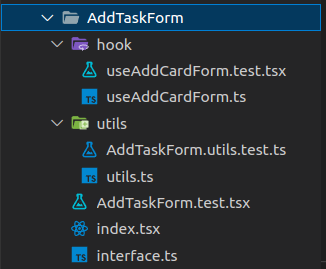

<div align="center">


</div>
<br/>
<br/>

## **💻 Project**

<p align="center">

</p>

This **Todo List** project was developed as an exercise to develop TDD architecture skills in frontend development. An own design pattern was created. The folder structure is as follows:

<p align="center">

</p>

Each component that has react state has a hook folder to separate the business rule from the TSX component states. This way we were able to test the hooks with the React Testing Library. Additional functions can be created in the utils folder as in the example below:

**_index.tsx_**

```tsx
function AddTaskForm() {
  const { task, handleTaskChange, handleClickAddButton } = useAddCardForm();
  return (
    <HStack>
      <Input
        data-testId='list-input'
        value={task}
        onChange={handleTaskChange}
        variant='flushed'
        placeholder='New task'
        bg='gray.800'
        _placeholder={{ color: 'whiteAlpha.600' }}
        color='whiteAlpha.800'
        fontWeight='700'
        outline='0'
        flex='2'
        borderRadius='5px'
        focusBorderColor='yellow.400'
        px='18px'
      />
      <Button
        flex='1'
        isDisabled={task === '' ? true : false}
        colorScheme='yellow'
        onClick={handleClickAddButton}
      >
        Add
      </Button>
    </HStack>
  );
}

export default AddTaskForm;
```

**_useAddCardForm.ts_**

```typescript
export const useAddCardForm = () => {
  const [task, setTask] = useState('');
  const { addCard } = useList();

  const handleTaskChange = useCallback((event: React.ChangeEvent<HTMLInputElement>) => {
    setTask(event.target.value);
  }, []);

  const handleClickAddButton = useCallback(() => {
    const format = formatMax(task);
    const newCard = { id: uuid(), task: format, completed: false } as CardData;
    addCard(newCard);
    setTask('');
  }, [addCard, task]);

  return { task, setTask, handleTaskChange, handleClickAddButton };
};
```

**_AddTaskForm.utils.test.ts_**

```typescript
describe('utils functions', () => {
  it('Should be return task with length equal 28, formatMax', () => {
    const max = 28;
    const mockedTask = 'aaaaaaaaaaaaaaaaaaaaaaaaaaaa'; // length equal 28
    const res = formatMax(mockedTask);
    expect(res.length).toBe(max);
  });
});
```

**_utils.ts_**

```typescript
function formatMax(task: string) {
  const max = 28;
  const taskLength = task.length;

  if (taskLength >= max) {
    const part = task.substring(0, max - 3);
    return `${part}...`;
  } else {
    return task;
  }
}

export { formatMax };
```

This way we can test each component part separately:

**_useAddTaskForm.test.ts_**

```tsx
describe('useAddCardForm hook', () => {
  afterEach(() => {
    vi.restoreAllMocks();
  });

  it('Should be inital task value equal ""', () => {
    const { result } = renderHook(() => useAddCardForm());
    expect(result.current.task).toBe('');
  });

  it('Should be task value equal "TEST"', () => {
    const { result } = renderHook(() => useAddCardForm());
    act(() => {
      result.current.setTask('TEST');
    });
    expect(result.current.task).toBe('TEST');
  });

  it('handleTaskChange, Should be task value equal "TASK"', () => {
    const { result } = renderHook(() => useAddCardForm());
    const mockedEvent = { target: { value: 'TASK' } } as React.ChangeEvent<HTMLInputElement>;
    act(() => {
      result.current.handleTaskChange(mockedEvent);
    });
    expect(result.current.task).toBe('TASK');
  });

  it('handleClickButton, Should be called once mockedAddList', () => {
    const wrapper = ({ children }: BoxProps) => <ListProvider>{children}</ListProvider>;
    const { result } = renderHook(() => useAddCardForm(), {
      wrapper,
    });
    const mockedUseList = vi
      .spyOn(hooks, 'useList')
      .mockImplementation(() => ({ AddCard: vi.fn() } as any));

    act(() => {
      result.current.handleClickAddButton();
    });
    expect(mockedUseList).toBeCalledTimes(1);
  });
});
```

## Get Started

```bash
yarn && yarn vite
```

## 🛠️ Test

```bash
yarn test
```

## **👨‍🚀 Author**

<a href="https://github.com/tpaphysics">

  <br />
  <sub>
    <b>Thiago Pacheco de Andrade</b>
  </sub>
</a>
<br />

👋 My contacts!

[](https://www.linkedin.com/in/thiago-pacheco-200a1a86/)
[](mailto:physics.posgrad.@gmail.com)
